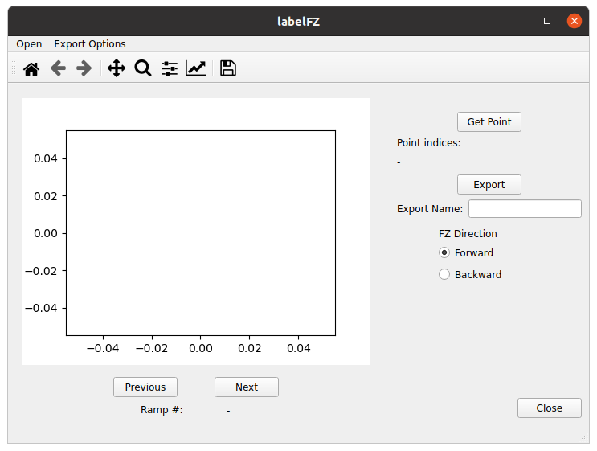
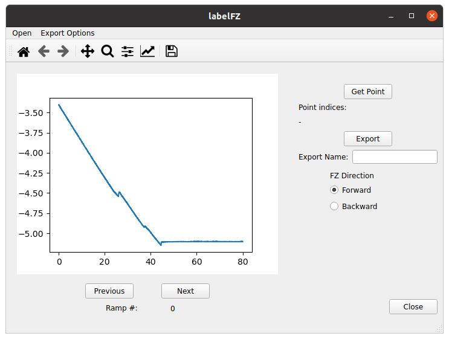

# labelFZ
Application for labelling points of interest in AFM force ramps/curves.

I use it to create datasets that later on I can use to train algorithms for automated detection of such points, which vcan be e.g., contact points, indentations and adhesion events.

Briefly it allows to:
1. Open a number of AFM force curves (fz) or a force volume file, and visualize each force curve individually. At present, it only works for data obtained with the Nanoscope 9 software.
2. Select an array of points for each fz.
3. For each fz, export in ascii format, and in 2 different files, the fz and the array of labelled points (more specifically, the indices of the force array corresponding to these points). 

## Quick start
1. Download/clone/fork the repo.
2. The app should work for any python 3.x. The easiest way to work with it would be from a virtual environment. A requirement file is provided. You can create it eg by going to the app main dir and then in the command line:
```
python -m venv
source venv/bin/activate
python -m pip install -r requirements.txt
```
3. Then, from the command line just run:
```
python -m labelFZ
```

This will open the labelFZ GUI:


4. In the menu bar go to *Open*, choose whether you want to load a series of force curves or a single force volume file. Then, you should be able to visualize the first fz of the series or of the force volume file:


5. The go in the menu bar to *Export Options -> Set Export Dir*, and select the directory where the output files will be saved.
6. 

