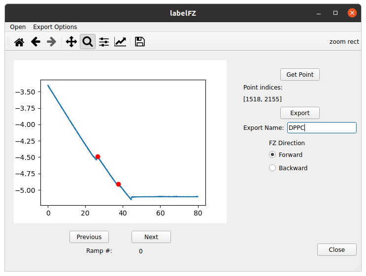

# labelFZ
Application for labelling points of interest in AFM (Atomic Force Microscopy) force ramps/curves.

I use it to create datasets that later on I can use to train algorithms for automated detection of such points, which can be e.g., contact points, indentations or adhesion events.

Briefly it allows to:
1. Open a number of AFM force curves (fz) or a force volume file, and visualize each force curve individually. At present, it only works for data obtained with the Nanoscope 9 software.
2. Select an array of points for each fz.
3. Export for each fz, in ascii format and in 2 different files, the fz and the array of labelled points (more specifically, the indices of the force array corresponding to these points). 

## Quick start
1. Download/clone the repo.
2. The app should work for any python 3.x. The easiest way to work with it would be from a virtual environment. A requirements file is provided. You can create it eg by going to the app main dir and then in the command line:
```
python -m venv
source venv/bin/activate
python -m pip install -r requirements.txt
```
3. Then, from the command line just run:
```
python -m labelFZ
```
This will open the labelFZ GUI:


4. In the menu bar go to *Open*, choose whether you want to load a series of force curves or a single force volume file. Then, you should be able to visualize the first fz of the series or of the force volume file:


Note that above the plot you have the matplotlib that allows to play with the figure or save it. Note also that to the right of the plot you have two radio buttons that allow to switch between the forward and backward directions of the fz.

5. Then, go in the menu bar to *Export Options -> Set Export Dir*, and select the directory where the output files will be saved.
6. In the *Export Name* edit box type the name you would like your saved files to have.
7. For selecting a point, just click on the *Get Point* push button, and then select the point in the plot. For instace, in the fz below I selected the 2 indentation events observed in the fz obtained on a DPPC bilayer:


Note that the indices corresponding to the selected points appear between the *Get Point* and the *Export* push buttons.

8. You can switch between loaded fzs with the *Previous* and *Next* push buttons below the fz plot. However, if you wish to export the fz and array of indices for labelled points, you need to do it by clicking the *Export* push button before switchin to a different fz (need to fix this...). The files will be saved in the selected directory as a combination of the name provided in the *Export Name* edit box and the *Ramp #* that appears below the plot. For instance, for the example above the fz will be saved in a file named *DPPC_0_fz.txt* and the indices for the labelled points in a file named *DPPC_0_labelled_points.txt*.

## Use/Support
You are welcome to use the app for your purposes. While I cannot commit to fix any bugs, if you want report them to me and I'll see what I can do.

